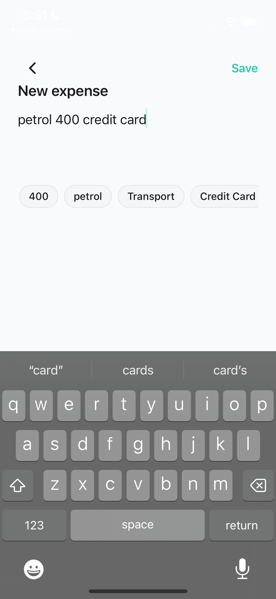
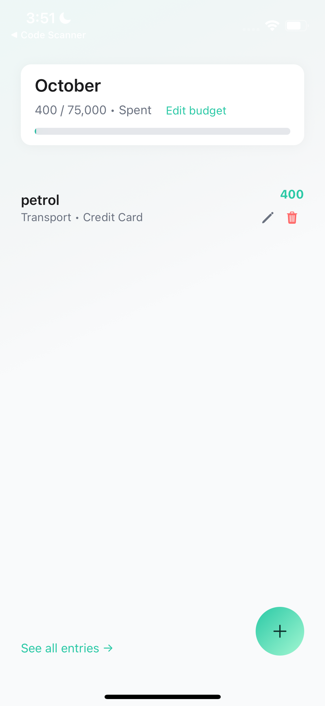
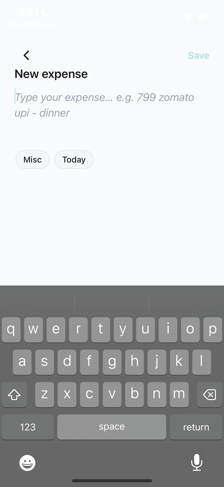
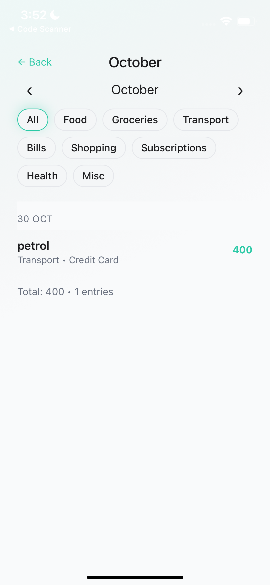

# Notes Expense (Expo · React Native · TypeScript)

A minimal, premium-feeling expense logger inspired by Apple Notes. Type a single line like:

```
799 zomato upi - dinner
```

It parses into a structured row (Amount • Merchant • Category • Method • Date), shows a clean monthly list with an animated progress bar, and lets you edit/delete quickly.

---

## Open in Expo Go (no login)

- Deep link: `exp://u.expo.dev/9b2c2cfa-e454-4053-88b8-d02bd7b2a66d?channel-name=preview`

[](exp://u.expo.dev/9b2c2cfa-e454-4053-88b8-d02bd7b2a66d?channel-name=preview)

> Requires a recent Expo Go (SDK 54) and a modern OS (iOS 17+ on Simulator or any recent Android).

---

## Screenshots

<p>
  
  
</p>
<p>
  
  
</p>

---

## Features

- Notes-style free‑text composer (add/edit)
  - Deterministic parser: amount → method → date → merchant → note → category
  - Live chips with stagger animation; dotted style possible for low-confidence/AI-guess
- List-first Home
  - Sectioned by day (Today / Yesterday / DD MMM)
  - Edit and Delete icons; Undo snackbar; Plus FAB to compose
- Monthly summary
  - Ratio (₹spent / ₹budget • Spent) with animated 8px progress bar
  - Over-budget badge (“Over by ₹X”), inline budget edit sheet
- Polished UX
  - Subtle motion, haptics; premium light theme; safe-area aware everywhere
- Local-first
  - Zustand store persisted with AsyncStorage (Expo Go friendly)

---

## Tech Stack

- Expo SDK 54, React Native 0.81, TypeScript
- Zustand + AsyncStorage, Reanimated, Gesture Handler, Safe Area
- Expo Haptics, Linear Gradient
- EAS Update (over-the-air publishing)

---

## Project Structure

```
src/
  App.tsx
  navigation/RootNavigator.tsx
  screens/
    HomeScreen.tsx              # List-first home
    ComposeExpenseScreen.tsx    # Add/Edit (Notes-style)
    AllEntriesScreen.tsx        # Full table view (sectioned by month/day)
    SettingsScreen.tsx          # Budget, AI toggle
  components/
    BudgetProgress.tsx          # Animated progress bar (teal/red)
    Chip.tsx                    # Glassy/dotted chips
    ExpenseRow.tsx              # Merchant/category/method/amount + icons
    PlusFab.tsx                 # Floating +
    UndoSnackbar.tsx            # Undo with accessibility
    Screen.tsx                  # Gradient background + safe-area padding
    NoteInput.tsx               # Free-flowing text area
  hooks/
    useExpenseStore.ts          # Zustand store (settings, expenses)
    useMonthlySpend.ts          # Monthly totals selector
    useParseExpense.ts          # Hook around `parse`
  utils/
    parse.ts                    # Deterministic parser
    money.ts, date.ts, id.ts
  theme/tokens.ts               # Colors/spacing/typography tokens
app.json                        # Expo config
```

---

## Install & Run

Prerequisites
- Node 20.19+ recommended (RN 0.81 requires Node ≥ 20.19.4)
- Expo Go on your device, or iOS Simulator (iOS 17+) / Android Emulator

Install & start
```
npm install
npx expo start -c
```
- Press `i` for iOS (Simulator 17+), `a` for Android, or scan the QR in Expo Go.

Useful scripts
```
npm run ios
npm run android
npm run web        # optional
```

---

## Publish (EAS Update)

This repo is already linked to EAS as `@nendhruv/notes-expense`.

Publish to the preview branch:
```
CI=1 npx eas update --branch preview --message "update"
```
<!-- Production (stable link) removed on request -->
If starting from a new account/project:
```
npx eas init --force
```

---

## How It Works (brief)

- `parse.ts` extracts amount (first number; INR normalized to paise), then method (UPI/Cash/Credit…), date (today/yesterday/dd/mm/dd mon), merchant (pre-separator), note (post-separator), and category via keyword map.
- `useExpenseStore.ts` keeps `settings`, `expenses`, and a small merchant→category “learning” map; persisted via AsyncStorage → runs in Expo Go without a Dev Client.
- `HomeScreen.tsx` renders the month header (ratio + progress), the dated SectionList, and a Plus FAB to open the composer.
- `ComposeExpenseScreen.tsx` is a free-flowing note area; chips reflect the parse; Save writes to the store and navigates back.

---

## Accessibility

- Buttons and icons include accessibilityLabel/Role/Hint (e.g., FAB “Add expense”, Undo, Edit/Delete row actions).
- Progress bar uses accessibilityRole="progressbar" and accessibilityValue { now, min, max }.
- Live announcements after Save / Undo via `AccessibilityInfo.announceForAccessibility`.
- 44pt hit targets; safe-area padding on all screens and sheets.

---

## Troubleshooting

- iOS Simulator crash (DYLD symbol): update to iOS 17+ runtime via Xcode → Settings → Platforms, then re-run.
- Expo publish (EAS) errors:
  - Ensure web is disabled in `app.json` platforms (we set to ["ios","android"]).
  - Use `CI=1` with EAS commands for non-interactive shells.
- Black/dark inputs in light mode: ensure inputs use `colors.surface` and `keyboardAppearance="light"` (already applied to the budget sheet).

---

## License

MIT (assignment/demo).
